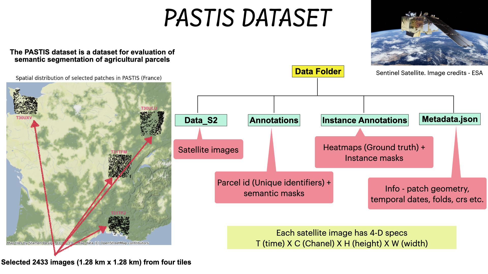

# Temporal Analysis and Segmentation - PASTIS Dataset
It is a comprehensive repository dedicated to exploring the intricacies of S2 satellite images. It delves into advanced techniques to analyze land parcel changes over time and provides segmentation methodologies. 

## PASTIS Dataset link

Dataset Source: [PASTIS Benchmark on GitHub](https://github.com/VSainteuf/pastis-benchmark/tree/main)

### Data Presentation
The structure and organization of the dataset are depicted in the figure below. This schematic representation provides a clear understanding of the data folders and their relationships, ensuring seamless navigation and utilization.
 

 ## Exploratory and Temporal data analysis

In the `EDA-temporal-analysis.ipynb` notebook, I have undertaken a comprehensive exploratory data analysis to understand the intricacies of the satellite images. The notebook highlights:

- Distribution and variance of different S2 images and crop type.
- Temporal changes and trends observed in pixel values, revealing seasonal patterns, changes due to human intervention, and other variations.

 

 

## Data Preprocessing and Semantic segmentation (2D U-Net)
In 'modeling.ipynb' notebook, we delve into the process of preparing our satellite image dataset for semantic segmentation tasks and leverage the power of the 2D U-Net architecture for this purpose.

**Data Handling**

- Temporal Augmentation: Each temporal slice of an image is treated as a distinct dataset entry.
- Consistent Masks: Masks remain unaltered across temporal slices, leading to repetitive label information.

**Segmentation Approach**

- Employed the 2D U-Net architecture known for its efficacy in high-resolution image segmentation tasks.

**Future Improvements**

- Introduce Temporal Consistency in segmentation across different temporal slices.
- Consider transitioning to 3D U-Net for a more holistic temporal analysis.
- Explore Advanced Augmentation techniques to diversify mask data.

## Link to Medium article
I plan to elaborate my code and learnings on Medium. Stay tuned!
